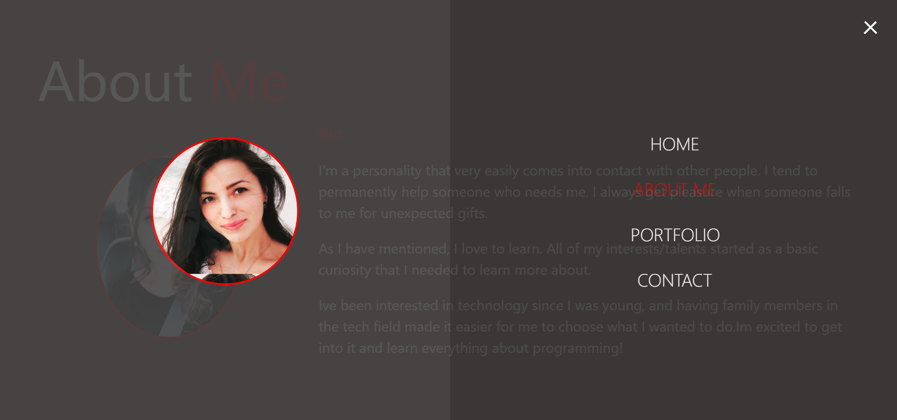
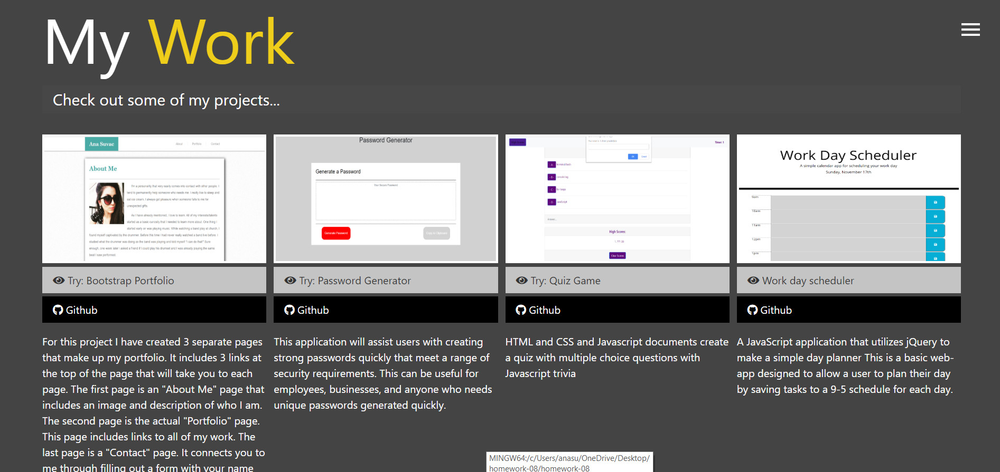

# homework-08
# Update portfolio 

Updated site  have the following content:

My name

Links to your GitHub profile & LinkedIn page as well as your email address and phone number

A link to a PDF of your resume

A list of projects. For each project, make sure you have the following:

Project title

Link to the deployed version

Link to the GitHub repository

Screenshot of the deployed application..

# Links :

 https://ana199816.github.io/homework-08/ - WebSite

 https://github.com/Ana199816/homework-08 - GitHub

 Screenshots : 
  
  